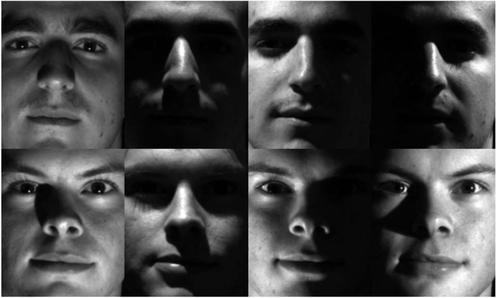
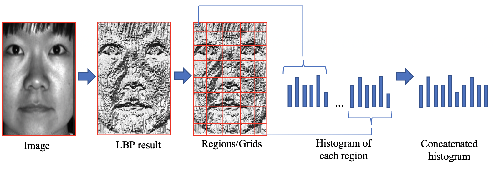

<h1 align="center"> A Comparative Study of PCA and LBP for Face Recognition Under Illumination Variations </h1>

<br/>
<br/>
<p align="center">
  
</p>

<p align="center">Fig 1. Yale Face Database</p>
<br/>

<div class='text-justify'><p>
The purpose of this study is to compare the facial recognition performance of PCA and LBP models, which have two different approaches. For this, the cropped Extended Yale Face Database B database was used and on this database, their performances in face recognition were compared on face images illuminated from 4 different angles [1]. Sample images are shown in Figure 1. A total of 2432 face images, including 64 different facial images of 38 subjects, were studied. In the training data, there are a total of 1440 face images from 48 images, 12 for each different lighting from 30 subjects. In the test data, there are 16 visuals for each 30 subjects in the training data with different illumination equally and 16 visuals from 8 subjects separated from the training data in the same way, a total of 608 visuals. The images were grayscale before being processed by the models. Roc Curve (Roc Curve) for evaluating the models and quantifying the quality of the estimates, as a performance criterion in correct definition; precision, precision and F1 measurement were used.
</p></div><br/>

<h2>How does PCA work?</h2>
<p>
  Principal component analysis is an unsupervised learning method that makes feature extraction. Unsupervised learning can be thought of as models that can learn, based on the relationships between data, without having prior knowledge about the data. Increasing the number of observations (data) and variables makes it difficult to draw relationships from data. PCA extracts basic components on the data set, takes the projections of the data on the components and determines the positions of the data relative to the principal components instead of the main (x, y) axes.</p>
  <p align="center">
  
</p>

<p>
In component extraction, the component with the highest variance is taken from the data groups, and dimensions with lower variance are not taken considering that they will not be as effective as the others in the decision-making process. In this way, the size is reduced. PCA is therefore also used for size reduction and shaping the data set. Size reduction benefits; It can be stated as shortening the calculation time, making the data more understandable and facilitating visualization.
</p>
<br/>
<h2>How does LBP work?</h2>
<p>
  Local Binary Pattern (LBP) is a simple yet very efficient texture operator which labels the pixels of an image by thresholding the neighborhood of each pixel and considers the result as a binary number (<a href="http://www.scholarpedia.org/article/Local_Binary_Patterns">Local Binary Patterns | Scholarpedia</a>).</p>
  <p align="center">
  
</p>

<br/><br/>
<h2>Sources</h2>
<ul>
  <li><a href="https://scikit-learn.org/">scikit-learn</a></li>
  <li><a href="https://opencv.org/">OpenCV</a></li>
  <li><a href="http://cvc.cs.yale.edu/cvc/projects/yalefacesB/yalefacesB.html">The Extended Yale Face Database</a></li>
</ul>  

<br/>

[1] Lee, K. C., Ho, J., Kriegman, D. J., “Acquiring linear subspaces for face recognition under variable lighting,” IEEE Transactions on pattern analysis and machine intelligence, vol. 27, no. 5, pp. 684-698, 2005.<br/>


## Citation Request

If you benefited from this project, please cite the following paper

```
@inproceedings{erol2020comparative,
  title={A Comparative Study of PCA and LBP for Face Recognition Under Illumination Variations},
  author={Erol, Mehmet Kaan and Kapan, Umut Arda and Ozturk, Muhammet Kerem and Uslu, Banu Calis Uslu and Bas, Anil},
  booktitle={2020 Innovations in Intelligent Systems and Applications Conference (ASYU)},
  pages={1--5},
  year={2020},
  organization={IEEE}
}
```
